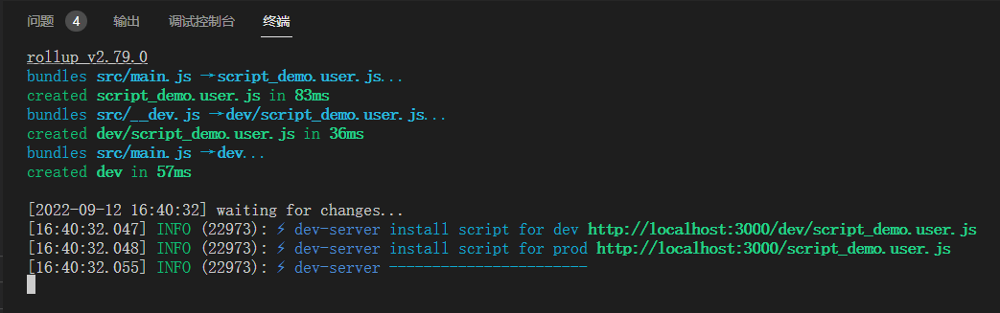

# rollup-plugin-monkey
[](https://github.com/wdssmq/rollup-plugin-monkey/releases)
[](https://www.npmjs.com/package/rollup-plugin-monkey)

使用 rollup 开发「GM_脚本」

----

git: [https://github.com/wdssmq/rollup-plugin-monkey](https://github.com/wdssmq/rollup-plugin-monkey "wdssmq/rollup-plugin-monkey: 使用 rollup 开发「GM\_脚本」")

npm: [https://www.npmjs.com/package/rollup-plugin-monkey](https://www.npmjs.com/package/rollup-plugin-monkey "rollup-plugin-monkey - npm")

## 相对不重要的外部链接

> 关于本项目的博文链接，以及 B 站视频演示；

<details>
<summary>点击这里查看</summary>

>「言说」写了份有点「大」的代码\_杂七杂八\_沉冰浮水：
>
> [https://www.wdssmq.com/post/20190704011.html](https://www.wdssmq.com/post/20190704011.html "「言说」写了份有点「大」的代码\_杂七杂八\_沉冰浮水")

>「折腾」使用 rollup.js 模块化编写 GM 脚本\_电脑网络\_沉冰浮水：
>
> [https://www.wdssmq.com/post/20120627834.html](https://www.wdssmq.com/post/20120627834.html "「折腾」使用 rollup.js 模块化编写 GM 脚本\_电脑网络\_沉冰浮水")

>「小代码」rollup.js 开发「GM\_脚本」演示\_哔哩哔哩\_bilibili：
>
> [https://www.bilibili.com/video/BV1qe4y1d7ZM](https://www.bilibili.com/video/BV1qe4y1d7ZM "「小代码」rollup.js 开发「GM\_脚本」演示\_哔哩哔哩\_bilibili")

</details>

## 已知问题

- ~~pnpm 下的正确姿势需要进一步探究；~~
- ~~`@require` 引入的函数库无法在开发模式下访问；~~

## 安装使用

- 下载「初始模板」文件并解压；「[点击这里下载]」
- 修改文件夹名为你的项目名；
- 进入项目文件夹后执行 `cpnm i` 安装依赖；「pnpm 目前还有点问题？」
- 「userscript header」由`src/__info.js`定义，以字符串形式；「这是和其他同类工具最大的不同」
  - `gm_name`将决定构建后的文件名；
  - `gm_require`则用于引入外部函数库；
- 可用命令：
  - `npm run dev`
  - `npm run build`
  - `npm run clear`
- 预置了`src/main.js`和`src/_base.js`等文件用于实际「GM_脚本」功能编写，可自行修改或增加；
- 你可以根据`script_def`示例维护一份自己的「初始模板」，主要是`src/__info.js`和`src/_base.js`；
- 本人习惯原因，正式文件会输出在项目根目录，由`rollup.config.mjs`内定义：
  - 可自行修改：``gm_file: `${gm_name}.user.js`,`` → ``gm_file: `dist/${gm_name}.user.js`,``

[点击这里下载]: https://github.com/wdssmq/rollup-plugin-monkey/releases/latest/download/script_def.tar.gz

<!-- [链接到发行版]: https://docs.github.com/cn/repositories/releasing-projects-on-github/linking-to-releases -->

```bash
PROJECT_SCRIPT=script_demo
# 下载初始模板
wget https://github.com/wdssmq/rollup-plugin-monkey/releases/latest/download/script_def.tar.gz
tar -xzvf script_def.tar.gz
rm -f script_def.tar.gz
mv script_def ${PROJECT_SCRIPT}
sed -i "s/\"script_def\"/\"${PROJECT_SCRIPT}\"/" ${PROJECT_SCRIPT}/src/__info.js
cd ${PROJECT_SCRIPT}
cnpm i

# 修改 src/__info.js 内常量定义

# 运行
npm run dev

```

<details>
<summary><strong>截图演示（点击展开）</strong></summary>



</details>

## CSP

Edge 插件：[Disable Content-Security-Policy](https://microsoftedge.microsoft.com/addons/detail/disable-contentsecurity/ecmfamimnofkleckfamjbphegacljmbp)

## 参考项目

|                               |                                                  |
| ----------------------------- | ------------------------------------------------ |
| lisonge/vite-plugin-monkey    | https://github.com/lisonge/vite-plugin-monkey    |
| pearofducks/rollup-plugin-dev | https://github.com/pearofducks/rollup-plugin-dev |
| thgh/rollup-plugin-livereload | https://github.com/thgh/rollup-plugin-livereload |
