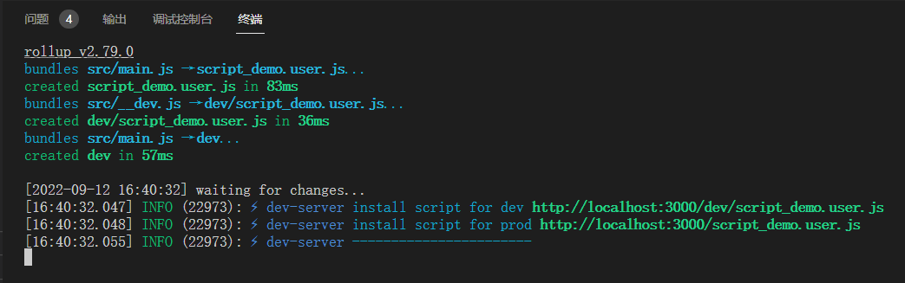

# rollup-plugin-monkey
[](https://github.com/wdssmq/rollup-plugin-monkey/releases)
[](https://www.npmjs.com/package/rollup-plugin-monkey)

使用 rollup 开发「GM_脚本」

----

git: [https://github.com/wdssmq/rollup-plugin-monkey](https://github.com/wdssmq/rollup-plugin-monkey "wdssmq/rollup-plugin-monkey: 使用 rollup 开发「GM\_脚本」")

npm: [https://www.npmjs.com/package/rollup-plugin-monkey](https://www.npmjs.com/package/rollup-plugin-monkey "rollup-plugin-monkey - npm")

## 相对不重要的外部链接

> 关于本项目的博文链接，以及 B 站视频演示；

<details>
<summary>点击这里查看</summary>

>「言说」写了份有点「大」的代码\_杂七杂八\_沉冰浮水：
>
> [https://www.wdssmq.com/post/20190704011.html](https://www.wdssmq.com/post/20190704011.html "「言说」写了份有点「大」的代码\_杂七杂八\_沉冰浮水")

>「折腾」使用 rollup.js 模块化编写 GM 脚本\_电脑网络\_沉冰浮水：
>
> [https://www.wdssmq.com/post/20120627834.html](https://www.wdssmq.com/post/20120627834.html "「折腾」使用 rollup.js 模块化编写 GM 脚本\_电脑网络\_沉冰浮水")

>「小代码」rollup.js 开发「GM\_脚本」演示\_哔哩哔哩\_bilibili：
>
> [https://www.bilibili.com/video/BV1qe4y1d7ZM](https://www.bilibili.com/video/BV1qe4y1d7ZM "「小代码」rollup.js 开发「GM\_脚本」演示\_哔哩哔哩\_bilibili")

</details>

## 已知问题

- ~~pnpm 下的正确姿势需要进一步探究；~~
- ~~`@require` 引入的函数库无法在开发模式下访问；~~

## 安装使用

- 下载「初始模板」文件并解压；「[点击这里下载]」
- 解压后进入 `template` 目录，执行 `pnpm install` 安装依赖；
- 运行 `pnpm run gen:gm` 生成新工程（默认输出到 `template/output/<项目名>`）；
- 进入生成后的项目目录，执行 `pnpm install` 后即可开始开发；
- 「userscript header」由 `src/__info.js` 定义，生成时会写入项目名、描述、匹配规则等字段；
- 常用命令：
  - `pnpm run dev`
  - `pnpm run build`
- 你可以在 `template/gm-base` 维护自己的基础模板，再通过生成器快速产出最终工程项目；
- 若希望将构建产物输出到 `dist`，可修改 `rollup.config.mjs` 中 `gm_file` 的路径。

[点击这里下载]: https://github.com/wdssmq/rollup-plugin-monkey/releases/latest/download/script_def.tar.gz

<!-- [链接到发行版]: https://docs.github.com/cn/repositories/releasing-projects-on-github/linking-to-releases -->

```bash
# 下载脚手架模板
wget https://github.com/wdssmq/rollup-plugin-monkey/releases/latest/download/script_def.tar.gz
tar -xzvf script_def.tar.gz
rm -f script_def.tar.gz
cd template
pnpm install

# 快速生成一个新工程（无交互）
PROJECT_SCRIPT=script_demo
pnpm run gen:gm -- --name ${PROJECT_SCRIPT} --description "try to take over the world!" --match "http://127.0.0.1:3000/,http://localhost:3000/" --namespace "https://www.wdssmq.com/"
cd output/${PROJECT_SCRIPT}
pnpm install
pnpm run dev

```

<details>
<summary><strong>截图演示（点击展开）</strong></summary>



</details>

## CSP

Edge 插件：[Disable Content-Security-Policy](https://microsoftedge.microsoft.com/addons/detail/disable-contentsecurity/ecmfamimnofkleckfamjbphegacljmbp)

## 参考项目

|                               |                                                  |
| ----------------------------- | ------------------------------------------------ |
| lisonge/vite-plugin-monkey    | https://github.com/lisonge/vite-plugin-monkey    |
| pearofducks/rollup-plugin-dev | https://github.com/pearofducks/rollup-plugin-dev |
| thgh/rollup-plugin-livereload | https://github.com/thgh/rollup-plugin-livereload |
